# 📄 Planeación del Sistema en Jira

## Desglose de trabajo: Épicas, Historias de Usuario y Tareas

La implementación de los requerimientos identificados de TechCup se desglosa de la siguiente manera:

### 1. Épica:

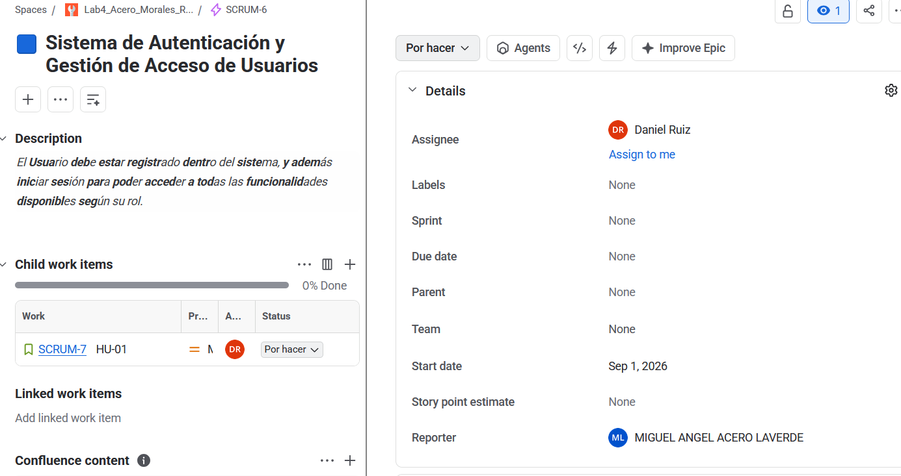

### 2. Historias de usuario:

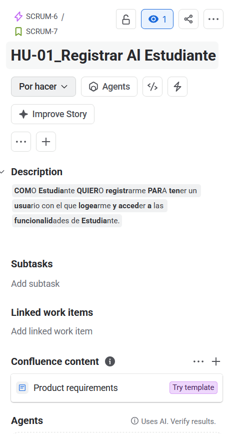
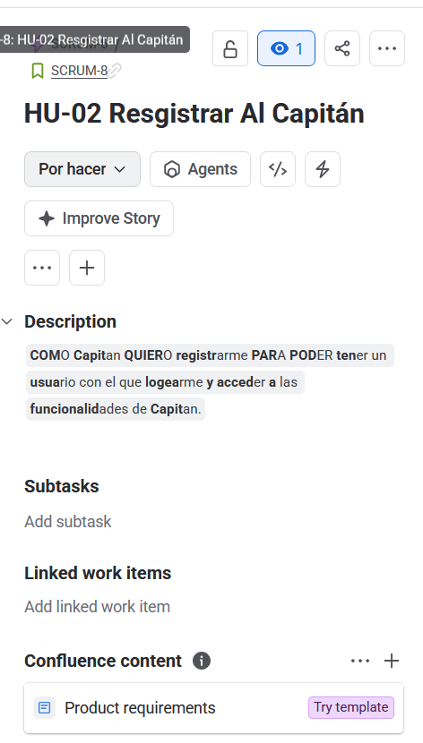
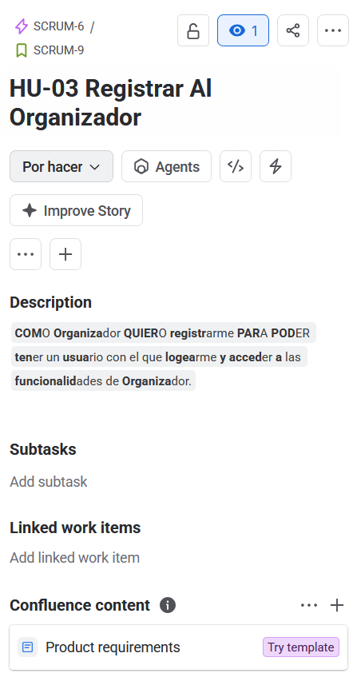
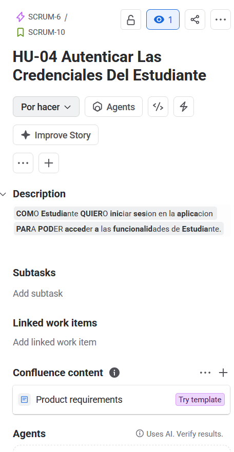
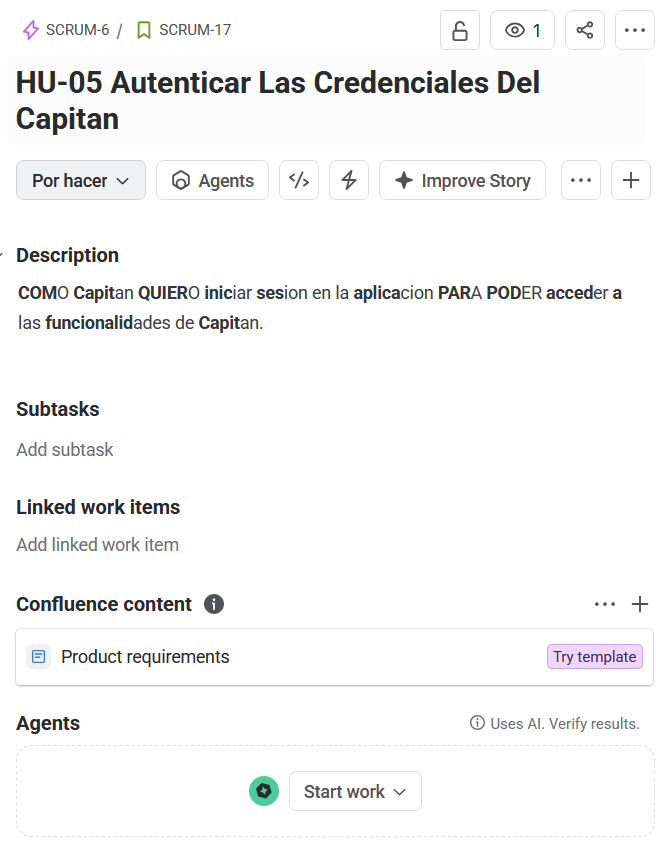
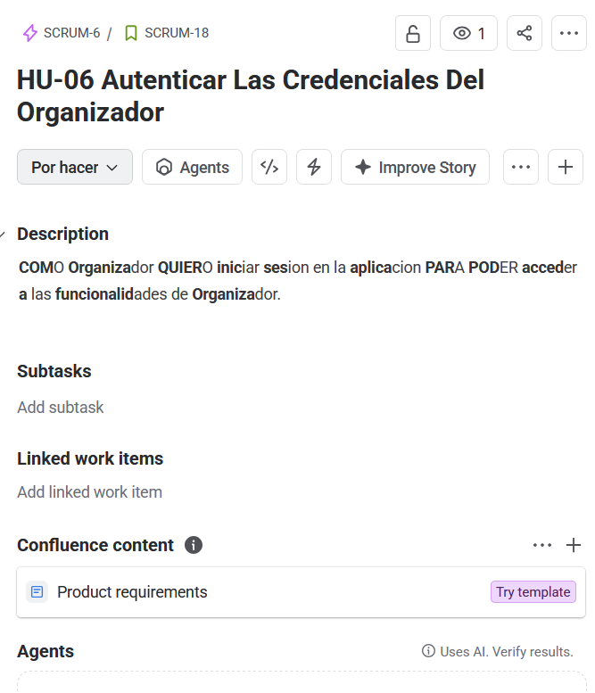

### 3. Tareas:

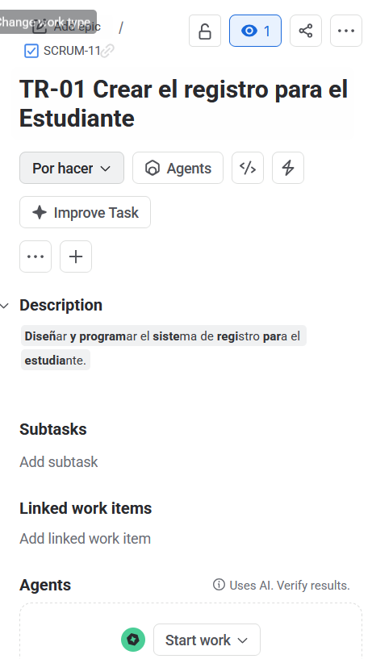
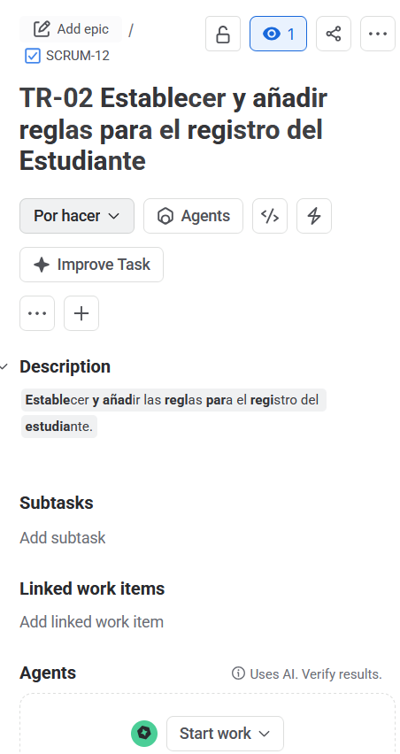
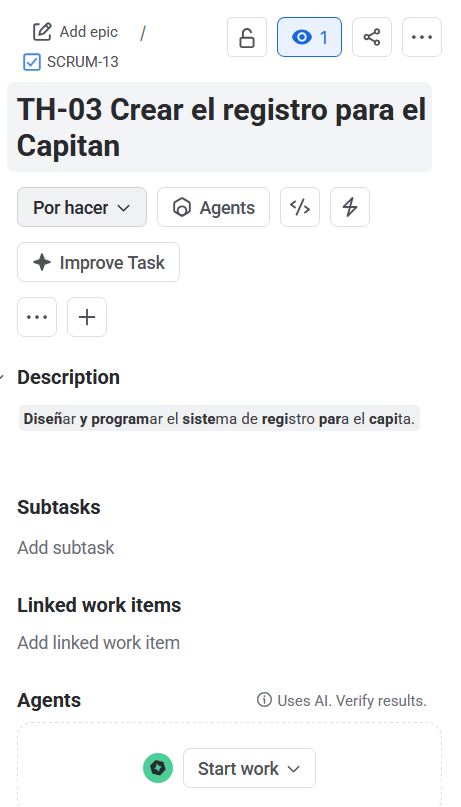
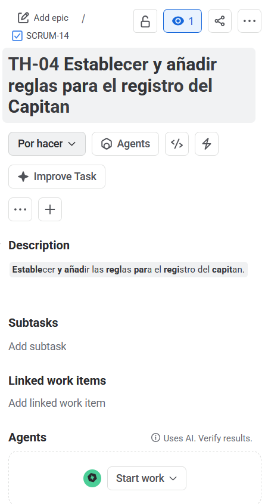
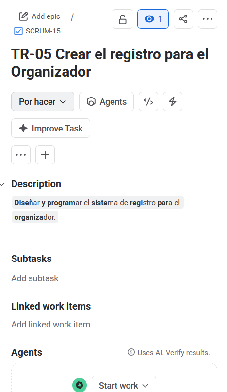
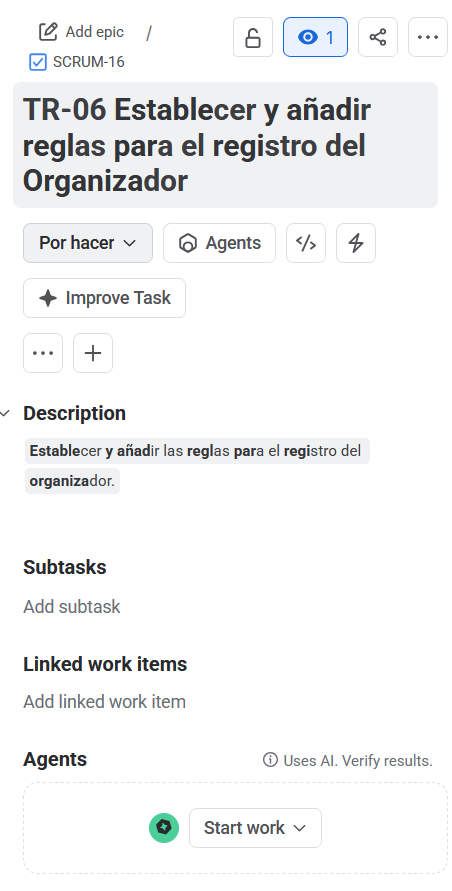
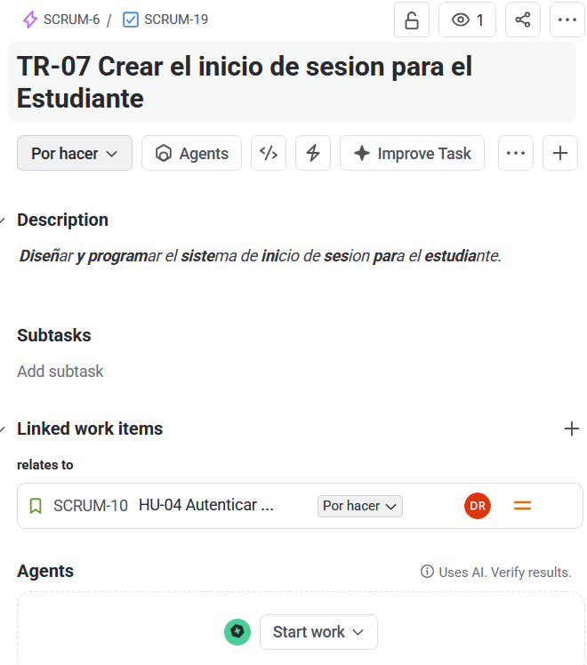
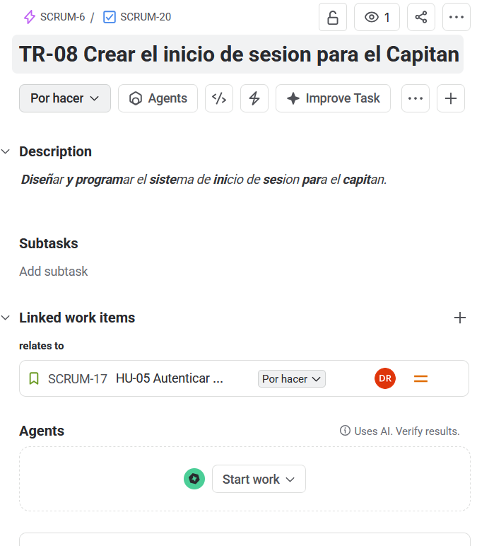
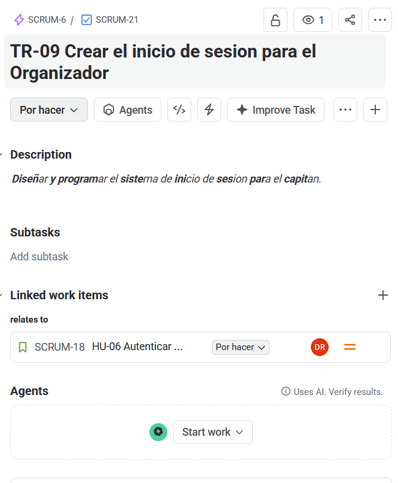
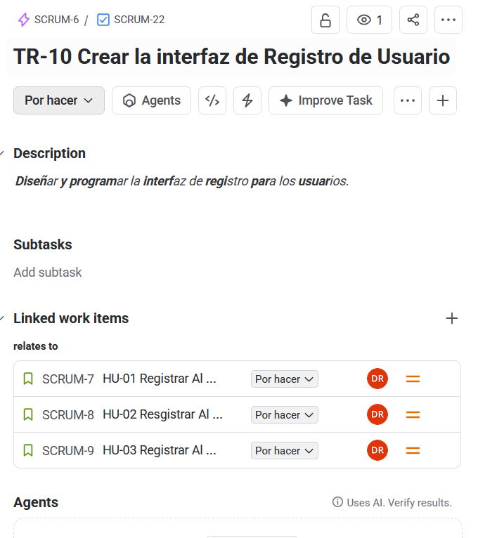
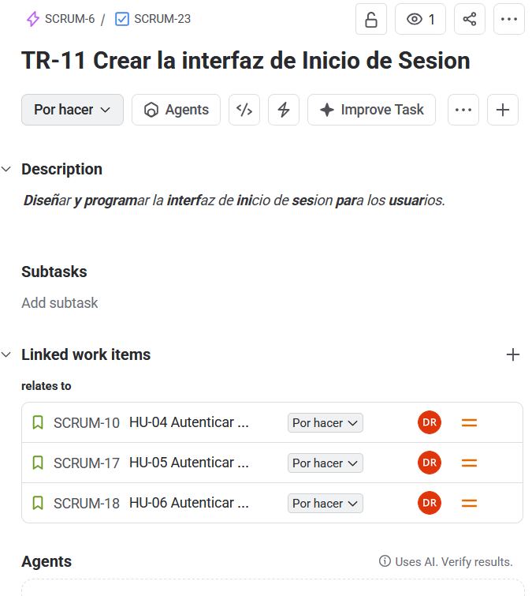

### 4. Cronograma:

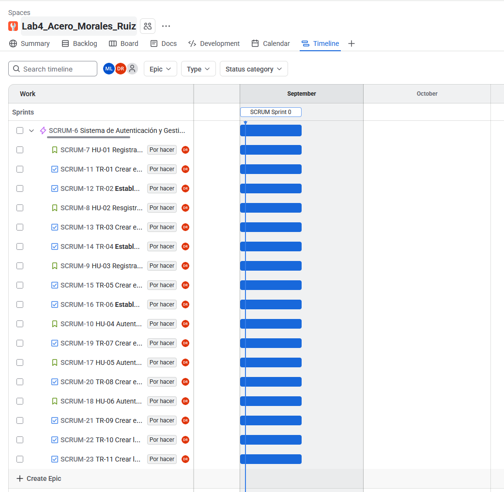

### 5. Backlog:

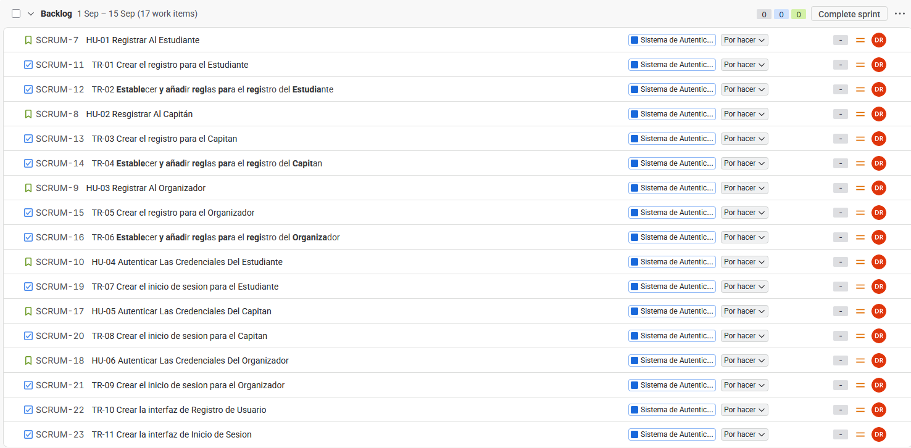

Decidimos que las tareas serían distributas entre los miembros del equipo de la siguiente manera:
1. TR-01 y TR-02 para Danil Ruiz
2. TR-03 y TR-04 para Daniel Morales
3. TR-05, TR-06 y TR-010 para Miguel Acero

Por decisión propia de cada integrantes hicimos la elección de las tareas que conideramos que son la base para contruir las demás. Así, el registro de sesión es importante para acceder a las demás funcionalidades.

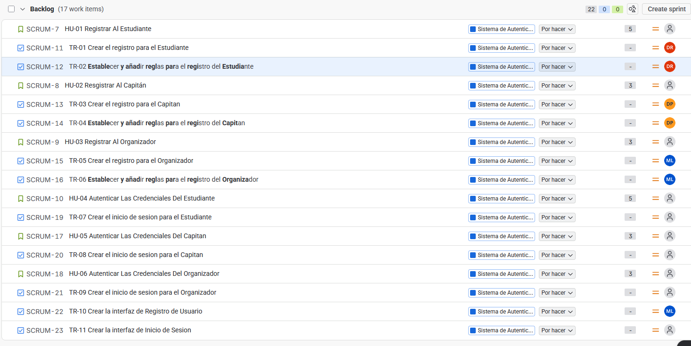
